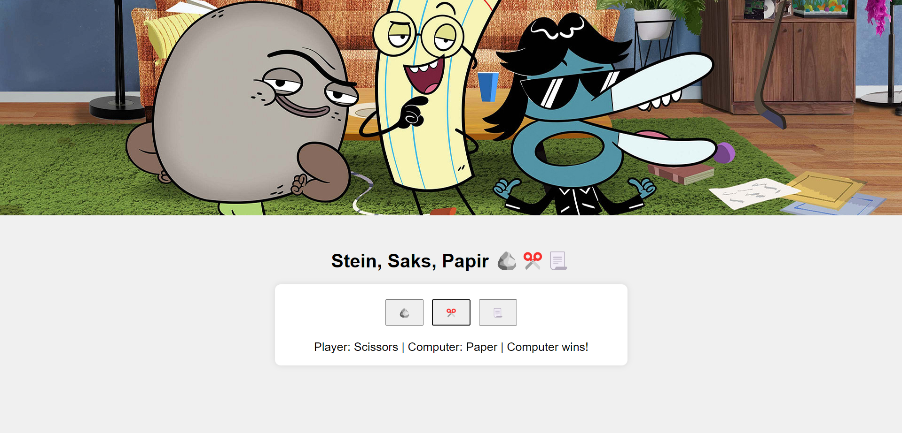

# Stein Saks Papir Spill

Dette er en enkel implementasjon av Stein Saks Papir-spillet ved hjelp av HTML, CSS, JavaScript og Firebase.

## Hvordan Spillet Fungerer

Spillet tillater spillere å velge mellom Stein, Saks eller Papir. Deretter genererer datamaskinen et tilfeldig valg, og resultatet vises på skjermen. Resultatet lagres også i Firebase-databasen.

## Implementasjon

- `index.html`: Inneholder HTML-strukturen for spillet og kobler til CSS og JavaScript-filer.
- `styles.css`: Definerer utseendet på spillet.
- `index.js`: Inneholder JavaScript-koden for spillets logikk, inkludert behandling av spillervalg, beregning av resultatet og lagring av resultater i Firebase-databasen.

## Firebase

Spillresultatene lagres i Firebase Realtime Database. En referanse til databasen opprettes ved hjelp av Firebase JavaScript SDK, og resultater legges til under 'results' node hver gang spillet spilles.

## Hvordan Kjøre Spillet Lokalt

1. Last ned prosjektfilene eller klone dette repositoryet.
2. Åpne `index.html` i en nettleser.

## Skjermbilde

